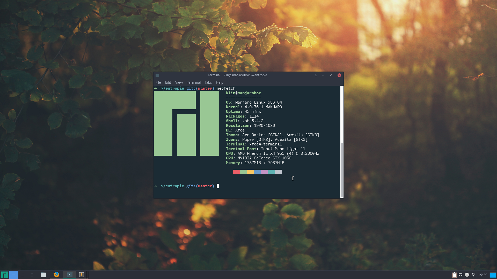
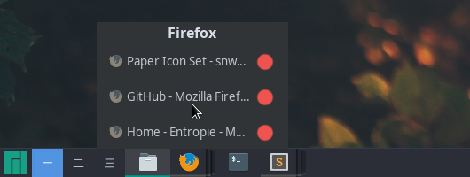

One year ago, I wiped my hard drive on my personal computer and installed Linux (I may explain the reasons later in another article).

After a few researches about all the different desktop environments that are available, my choice went to XFCE because I liked how it is very lightweight and still very customizable.
I really had a feeling of being empowered as a user with it.

The only drawback of this desktop environment is that it is really ugly by default:

Since I'm not in love with those 90's like interfaces, I looked for a way to get something more clean.

At first, I was not sure about the interface I wanted to create. I enjoyed both MacOS and Windows' UI so I tried to recreate them with XFCE.

But I failed at recreating a convinceful MacOS-like topbar that would contain the menu for each application.
Indeed, the problem with Linux applications is that they can use different frontend languages: some will use GTK, others QML, etc.
So since you have different frontend languages, it is difficult to have a single top bar that will integrate nicely with all of them.

That's why I went with a Windows-like UI. Here is the result:

Pretty classic: a bar at the bottom containing from left to right, applications menu, desktop spaces list, applications list, quick access icons, clock, and a "return to desktop" button.

In order to replicate Windows 7+ applications list, I had to install the DockbarX module and customize it with the [NokuTofu](https://github.com/bhajneet/Noku-Tofu) theme so it looks like this:

If ever you are interested, you can dig into [my dotfiles](https://github.com/qbarbosa/dotfiles) but I don't do much with them.

All of this was obviously inspired by [/r/unixporn](https://www.reddit.com/r/unixporn/) but was mostly taken from [this post](https://www.reddit.com/r/unixporn/comments/644d1o/xfce_1_year_of_linux_6_mos_of_stable_rice) written by -Chase.
I'm thankful for all the details he provides in his post.

This article was written while listening to ["2+2=5"](https://www.youtube.com/watch?v=lstDdzedgcE) by Radiohead.
