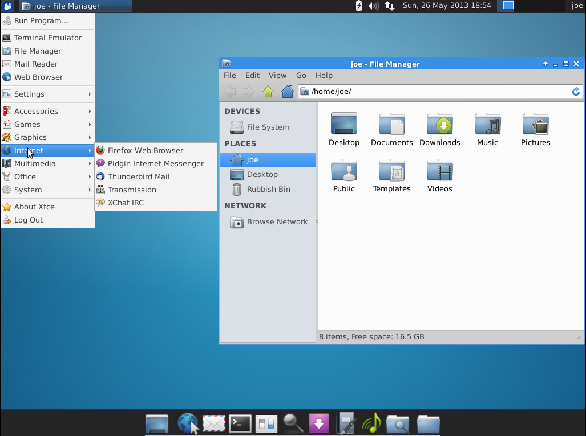
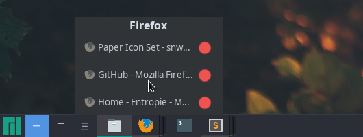

One year ago, I wiped my hard drive on my personal computer and installed Linux (I may explain the reasons later in another article).

Here is how I managed to get a desktop I enjoy using.

## Desktop environment
After a few researches about all the different desktop environments that are available, my choice went to XFCE because I liked how it is very lightweight and still very customizable.

I really had a feeling of being empowered as a user with it.

The only drawback of this desktop environment is that it looks really ugly by default:

Since I'm not in love with those 90's like interfaces, I looked for a way to get something more clean.

People on Reddit call this process "ricing".
> "Rice" is a word that is commonly used to refer to making visual improvements and customizations on one's desktop. It was inherited from the practice of customizing cheap Asian import cars to make them appear to be faster than they actually were - which was also known as "ricing". The word is accepted by the majority of the community and is used sparingly to refer to a visually attractive desktop upgraded beyond the default.

## Layout
At first, I was not sure about the interface layout I wanted to have. I enjoyed both MacOS and Windows' UI so I tried to recreate them with XFCE.

But I failed at recreating a convinceful MacOS-like topbar that would contain the menu for each application.
Indeed, the problem with Linux applications is that they can use different frontend languages: some will use GTK, others QML, etc.
So since you have different frontend languages, it is difficult to have a single top bar that will integrate nicely with all of them.

That's why I went with a Windows-like layout. Here is the result:

Pretty classic: a bar at the bottom containing from left to right, applications menu, desktop spaces list, applications list, quick access icons, clock, and a "return to desktop" button.

I did this by installing the DockbarX module and customizing it with the [NokuTofu](https://github.com/bhajneet/Noku-Tofu) theme.

## Theme

Finally, to get rid of the old look, I changed the GTK theme, fonts, and icons as follows:
- _GTK theme_: [Arc Theme](https://github.com/horst3180/arc-theme)
- _Icons_: [Paper icons pack](https://snwh.org/paper)
- _Fonts_: "Noto Sans" in the ordinary windows, "[Input](http://input.fontbureau.com/)" in the terminal and code editors.

---

All of this was obviously inspired by [/r/unixporn](https://www.reddit.com/r/unixporn/) but was mostly taken from [this post](https://www.reddit.com/r/unixporn/comments/644d1o/xfce_1_year_of_linux_6_mos_of_stable_rice) written by -Chase.
I'm thankful for all the details he provides there.

If ever you are interested, you can dig into [my dotfiles](https://github.com/qbarbosa/dotfiles) as well but I don't do much with them.

Customizing my desktop might seem like something useless but I think it was a good way to learn more about Linux. 
Now, I look to my computer in a different way, knowing that every interface can be changed and that I don't have to keep the default one if I don't like it.
I would definitely recommend going through this process if you want to learn, plus it feels good to build your desktop exactly as you want. 

---

This article was written while listening to ["2+2=5"](https://www.youtube.com/watch?v=lstDdzedgcE) by Radiohead.
