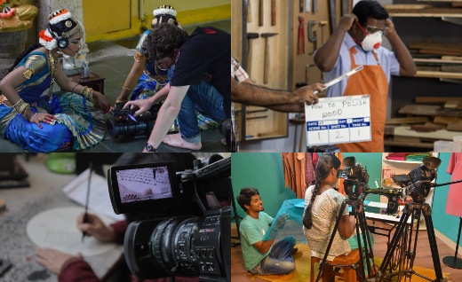
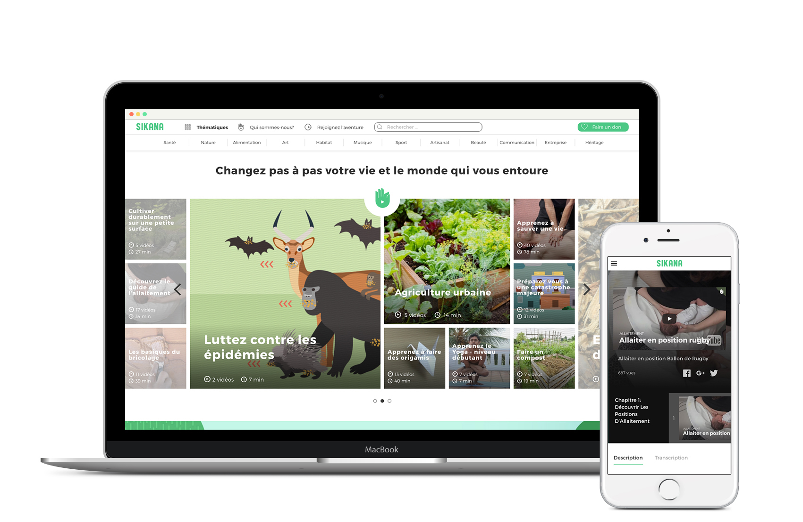
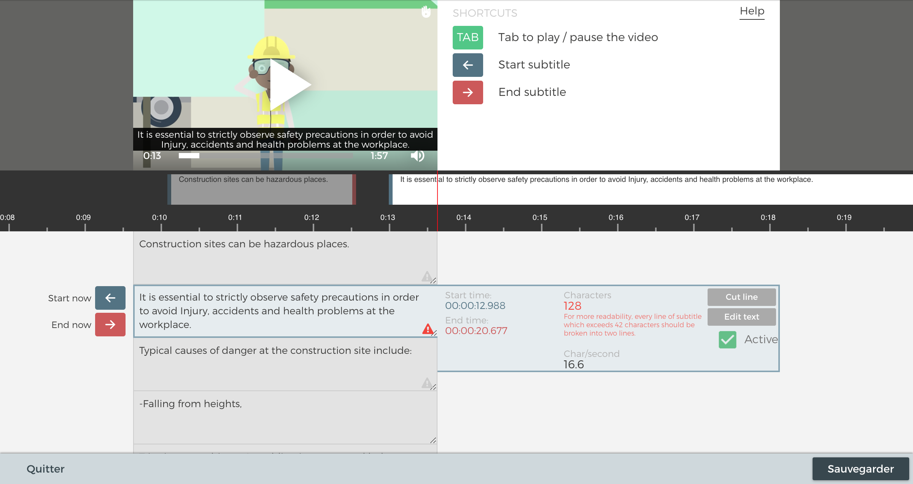
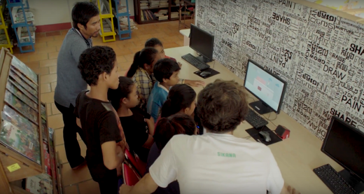
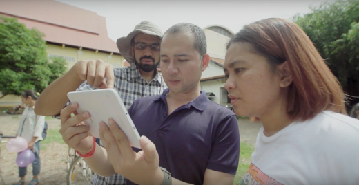

Sikana est une ONG qui a pour but de lutter contre la pauvreté en partageant les savoir-faire.

L'idée vient d'un constat simple : les pays dits "pauvres" disposent en fait de ressources à leur disposition. Il leur manquerait surtout le savoir-faire, et parfois l'envie, afin de les utiliser et rendre leur environnement plus sain et agréable à vivre.

Sikana (écriture phonétique de l'Hindi "सिखाना", signifiant "Apprendre" ou "Enseigner") souhaite répondre à cette problématique en inspirant les gens à agir.
En leur montrant que changer le monde autour de soi est possible en apprenant certains gestes très simples.

Ce mouvement a donné naissance à une communauté internationale qui recueille le savoir-faire de différents experts autour du globe et qui le rend accessible à tous à travers du contenu pédagogique (vidéos, fiches pédagogiques, infographies, ...).

En temps que développeur chez Sikana, je travaille sur la plateforme en ligne [sikana.tv](https://www.sikana.tv) qui diffuse ces vidéos, et qui permet également à des bénévoles d'aider à concevoir et traduire le contenu.

La plateforme se divise donc en deux parties :
* [_sikana.tv_](https://www.sikana.tv) qui est la plateforme pédagogique aujourd'hui disponible en 10 langues.
* [_factory.sikana.tv_](https://factory.sikana.tv) qui est la plateforme de traduction pour les bénévoles.

## Sikana.tv, la plateforme pédagogique

La plateforme pédagogique est disponible en 10 langues, et son contenu est organisé en 6 catégories : Cuisine, Art, Bricolage, Nature, Santé, et Sport.

Des sujets très divers y sont abordés : "Apprendre les gestes de premier secours", "Installer des panneaux solaires", "Débuter au Yoga", "Rénover des meubles", ou encore "Cultiver son jardin".

Chacun de ces sujets fait l'objet d'un programme pégadogique, lui-même segmenté en chapitres, qui contiennent chacun des vidéos, des infographies, ou des fiches pédagogiques. Ces programmes sont conçus en partenariat avec d'autres acteurs du milieu associatif (la Croix rouge, Électriciens sans frontières, Emmaüs, etc.) qui viennent apporter leurs connaissances.

Tout ce contenu est accessible gratuitement, en streaming et en téléchargement libre, sous licence Creative Commons.

## Factory, la plateforme collaborative

Pour traduire tout ce contenu en 10 langues, Sikana s'appuie sur sa communauté de bénévoles. Ces bénévoles utilise l'outil _Factory_.

On y trouve un outil de traduction du site web, un outil de traduction pour les scripts des vidéos, ainsi qu'un outil de sous-titrage.

Les traductions sont revues et validées par une équipe interne, mais nous espérons à terme améliorer suffisamment la plateforme pour que la relecture des volontaires par les volontaires soit suffisante.

## Impact

Comme je l'écrivais plus haut, le contenu de Sikana est disponible gratuitement sur sikana.tv, mais aussi sur différentes plateformes de streaming telles que [YouTube](https://www.youtube.com/channel/UCh7USEhj35y1uxfT7-WPhFg), NetEase, [Pear video](https://www.pearvideo.com/column_1202), ...
Il cumule à l'heure où j'écris ces lignes plus de 31 millions de vues toutes plateformes confondues.

Le contenu est également utilisé sur le terrain par des acteurs divers du milieu associatif.

La Croix Rouge utilise notre programme pédagogique sur les gestes de premier secours dans ses centres de formation partout dans le monde et dans son application "l'appli qui sauve".
Emmaüs enseigne la rénovation de meubles avec nos vidéos, des professeurs d'EPS de l'Éducation nationale se servent de nos vidéos de sport pour montrer les gestes techniques aux élèves, ...

Enfin, avec le téléchargement libre des vidéos sur le site, nous ne sommes même pas au courant de toutes les initiatives qui sont nées autour du monde avec notre contenu.
Parfois nous avons de bonnes surprises en recevant des remerciements et des photos venant d'une école en Chine, en Afrique, en Amérique du Sud, ...

Cet article a été écrit en écoutant ["Kabuki"](https://www.youtube.com/watch?v=HR8kixSjOl0) de Teho & TRan.
